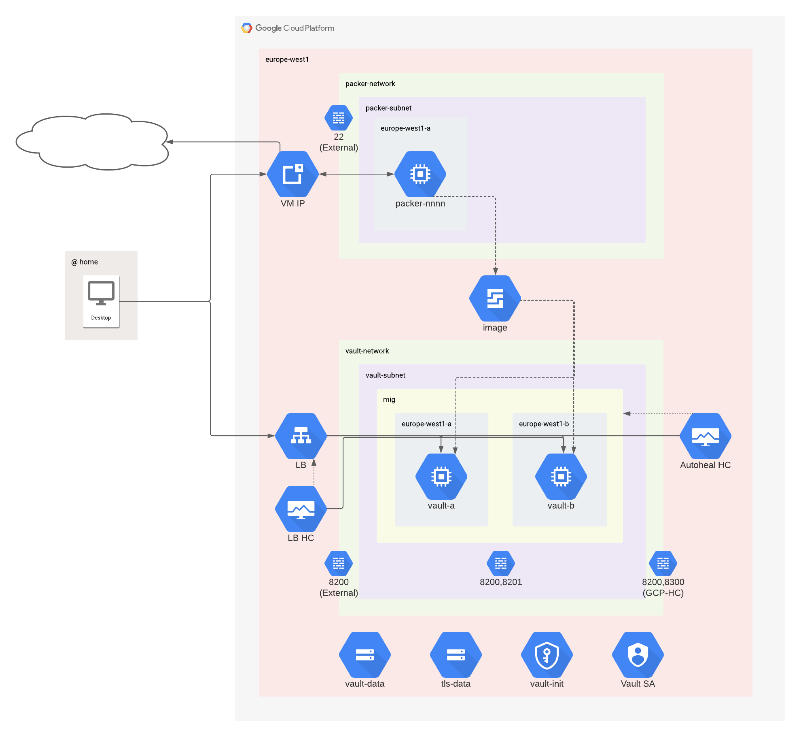

# Vault on GCE

Demo repository to show how to get HashiCorp Vault up and running in GCP, using Packer and Terraform Cloud, with the minimum amount of fuss.

This code started from, and is based on, the public module https://registry.terraform.io/modules/terraform-google-modules/vault/google/latest.

## Steps

### Step 1: Bootstrap a new GCP project

## Usage

Run `./bootstrap.sh` to:

1. Create a new GCP project and perform configuration so it can be used by Packer

1. Build a Vault VM image using Packer

1. Create a Compute Engine Vault cluster using the backed image

## Detroy

Run `./unbootstrap.sh` to:

1. Destroy all infrastructure

1. Delete the GCP project

