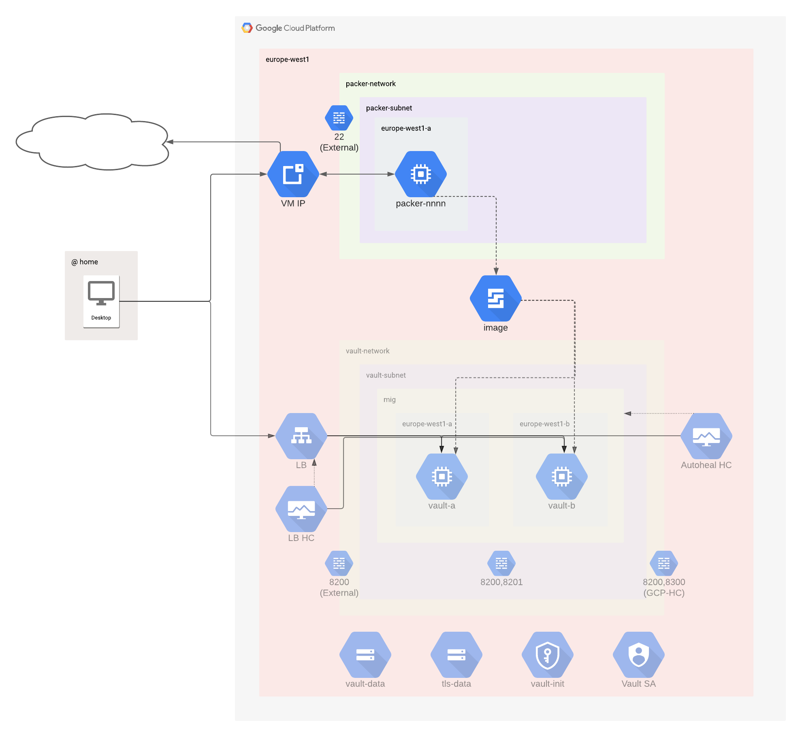

# Bootstrap

Bootstraps a new GCP project so it can be used by Packer and Vault.

## Resources

1. Ensure all necessary GCP APIs are enabled

1. Create a VPC and subnet that Packer can use

1. Open port 22 so Packer can SSH to its VMs

1. Create a new Terraform Cloud workspace and set variables so the Vault resources can be deployed

