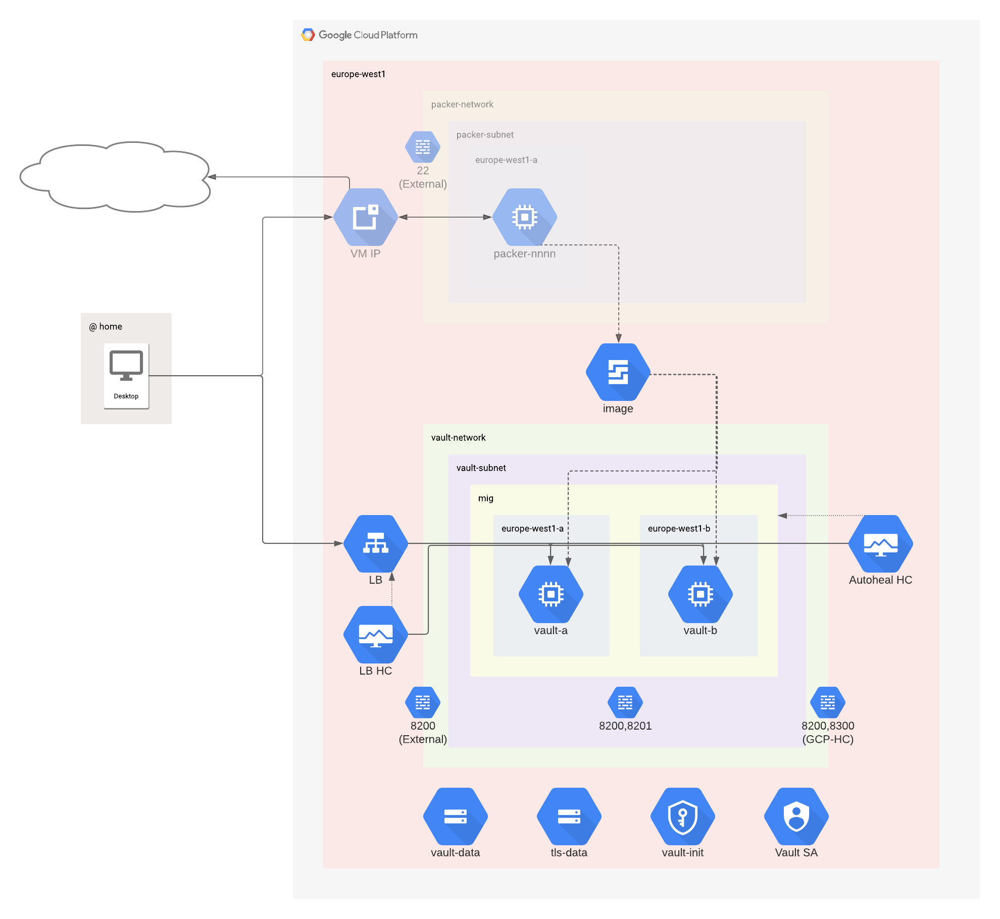

# Vault

Deploys a Vault OSS cluster on GCP Compute Engines

## Resources

1. Creates a VPC and subnetwork in `europe-west1` (Belgium, slightly cheaper than London with no significant latency penalty)

1. Creates a regional managed instance group spanning all 3x availability zones

1. Deploys 2x VMs using the Vault VM image created by Packer in the previous step. 

1. Final configuration is performed by bash startup script.

1. Creates a regional TCP load balancer to expose Vault on port 8200

## Features

1. VPC and subnet expose only port 8200, and only to a single specified external IP address.

1. MIG autoscales (2 - 3 VMs) and autoheals (based on HTTP health check vs port 8300)

1. Vault cluster VMs can communicate internally on ports 8200 & 8201

1. Vault cluster runs under a specific service account following the principal of least privilege

1. TLS certificates are generated on-the-fly by terraform. This is ugly, but it's just a demo!

1. TLS certificates are stored in a GCS bucket by terraform. Only the Vault SA can read.

1. GCS is used as the (HA) storage backend for Vault. See https://www.vaultproject.io/docs/configuration/storage/google-cloud-storage

1. GCP KMS auto-unseal is used. See https://www.vaultproject.io/docs/configuration/seal/gcpckms

1. Regional network load balancer exposes Vault cluster to external trusted IPs (my desktop)

1. Load balancer health check ensures traffic is only sent to the cluster primary VM

